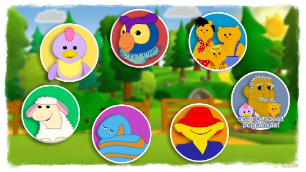
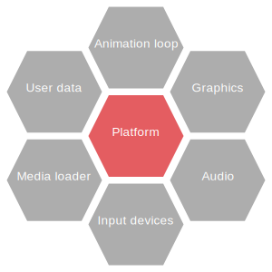

MultimediaLib
=============

Framework for building multimedia applications that support desktop, mobile, and web. 
MultimediaLib is mainly targeted at 2D graphics and animation.

MultimediaLib supports several different platforms:

- **Desktop:** Windows, Mac OS, Linix
- **Mobile:** iOS, Android
- **Web:** HTML5, WebGL

The large variety in platforms means applications need to account for many things. They need to
support different screen sizes, resolutions, and aspect ratios. They need to support different
input methods, such as keyboard, mouse, and touch. They need to account for different graphics
capabilities, as some platforms can use hardware-accelerated graphics but others cannot.

To facilitate this, MultimediaLib acts as an abstraction layer between the application layer
and the underlying platform. This is a similar approach to other frameworks, but MultimediaLib
differs in that it targets not only different mobile platforms, but also allows the same
application to be used on desktop platforms and from the browser.
    
Usage
-----

The library is available from the Maven Central repository. To use it in a Maven project, add it 
to the dependencies section in `pom.xml`:

    <dependency>
        <groupId>nl.colorize</groupId>
        <artifactId>multimedialib</artifactId>
        <version>2019.2</version>
    </dependency>  
    
The library can also be used in Gradle projects:

    dependencies {
        compile "nl.colorize:multimedialib:2019.2"
    }
    
Transpiling applications to HTML5/JavaScript
--------------------------------------------

Applications using MultimediaLib are written in Java. However, these applications can be transpiled
to a combination of HTML and JavaScript so that they can be distributed via the web. This is done
using [TeaVM](http://teavm.org) and therefore only supports a subset of the Java language. 
Transpilation is started using the `TeaVMTranspiler` that is included as part of the library.
This command line tool takes the following arguments:

| Name         | Required | Description                                                        |
|--------------|----------|--------------------------------------------------------------------|
| -project     | yes      | Project name for the application.                                  |
| -resources   | yes      | Directory containing the application's resource files.             |
| -out         | yes      | Output directory for the generated files.                          |
| -main        | yes      | Main class that acts as application entry point.                   |
| -incremental | no       | Enable to preserve existing resource files and not overwrite them. |

Packing multiple images into a sprite sheet
-------------------------------------------

A "sprite sheet" is a large image that consists of a large image that contains multiple sprites,
with each sprite is identified by a name and a set of coordinates. A sprite sheet consists of the
image plus a YAML file describing those coordinates. On most platforms sprite sheets have better
performance characteristics than loading the images individually. 

MultimediaLib includes a tool to create a sprite sheet from all images within a directory. This
tool is started using `SpriteSheetPacker` that is part of the library. The tool takes the 
following arguments.

| Name      | Required | Description                         |
|-----------|----------|-------------------------------------|
| -input    | yes      | Directory containing source images. |
| -outimage | yes      | Generated image file location.      |
| -outdata  | yes      | Generated YAML data file location.  |
| -size     | yes      | Width/height of the sprite sheet.   |
    
Starting the demo application
-----------------------------

MultimediaLib includes a simple demo application that showcases some of its features and can be 
used as an example when using the framework to create applications. The demo application can also
be used for verification purposes when testing the framework on new platforms.

To run the demo for desktop platforms, create a normal build of the library using `gradle assemble`,
which builds both the desktop and browser versions.

To start the desktop version of the demo application, run the class
`nl.colorize.multimedialib.tool.DemoLauncher`. This class supports the following command line 
parameters:

| Name          | Required | Description                                 |
|---------------|----------|---------------------------------------------|
| -renderer     | yes      | Renderer to use for the demo (java2d, gdx). |
| -framerate    | no       | Demo framerate, default is 60 fps.          |
| -verification | no       | Prints instructions for verification.       |

The browser version of the demo application is saved to the directory `build/browserdemo`, 
and can be started by opening `index.html` in a browser.

Build instructions
------------------

The build is cross-platform and supports Windows, macOS, and Linux, but requires the following 
software to be available:

- [Java JDK](http://java.oracle.com) 11+
- [Gradle](http://gradle.org)
- [Android SDK](https://developer.android.com/sdk/index.html) (when building for Android)
- [RoboVM](https://github.com/MobiVM/robovm) (when building for iOS)

The following Gradle build tasks are available:

- `gradle clean` cleans the build directory
- `gradle assemble` creates the JAR file for distribution
- `gradle assemble -b build-gwt.gradle` creates the GWT build of the library
- `gradle test` runs all unit tests
- `gradle coverage` runs all unit tests and reports on test coverage
- `gradle javadoc` generates the JavaDoc API documentation
  
License
-------

Copyright 2011-2019 Colorize

The source code is licensed under the Apache License 2.0, meaning you can use it free of charge 
in commercial and non-commercial projects as long as you mention the original copyright.
The full license text can be found at 
[http://www.colorize.nl/code_license.txt](http://www.colorize.nl/code_license.txt).

By using the source code you agree to the Colorize terms and conditions, which are available 
from the Colorize website at [http://www.colorize.nl/en/](http://www.colorize.nl/en/).
