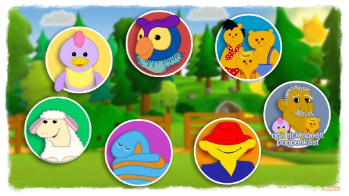
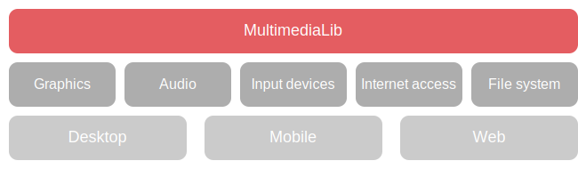

MultimediaLib
=============

MultimediaLib is a framework for creating multimedia applications in Java that run on multiple
platforms: desktop applications (Windows, Mac OS, Linux), mobile apps (iOS, Android), and web
(browser, PWA). MultimediaLib mainly targets 2D graphics and animation, though support for basic
3D graphics is also provided.

MultimediaLib acts as an abstraction layer between the application and the platform's underlying
resources, such as graphics, audio, input, and network access. Other frameworks use a similar
approach, but tend to target mobile platforms, native applications (on mobile/desktop/both), or
web applications. MultimediaLib's main strength is that applications will run on *all* those
different platforms.

MultimediaLib has been in use since all the way back to 2007. It used to support long-forgotten
front-end technologies like [Java Web Start](https://en.wikipedia.org/wiki/Java_Web_Start). It
later transitioned to browser-based technologies once [WebGL](https://en.wikipedia.org/wiki/WebGL)
became widely supported, while still retaining its original support for desktop applications.
    
Usage
-----

The library is available from the Maven Central repository. To use it in a Maven project, add it 
to the dependencies section in `pom.xml`:

    <dependency>
        <groupId>nl.colorize</groupId>
        <artifactId>multimedialib</artifactId>
        <version>2025.1</version>
    </dependency>  
    
The library can also be used in Gradle projects:

    dependencies {
        implementation "nl.colorize:multimedialib:2025.1"
    }
    
Supported platforms
-------------------

MultimediaLib provides multiple *renderers*, that act as the interface between the application
and the underlying platform. Multiple renderer implementations are provided. This allows 99%
of application code to be cross-platform, apart from a small platform-specific launcher that
initializes the application with the correct renderer.

The following renderer implementations are available:

| Renderer                                            | Graphics | Platforms                      |
|-----------------------------------------------------|----------|--------------------------------|
| Java2D renderer                                     | 2D       | Windows, Mac                   |
| [JavaFX](https://openjfx.io) renderer               | 2D       | Windows, Mac                   |
| [libGDX](https://libgdx.badlogicgames.com) renderer | 2D + 3D  | Windows, Mac, Android          |
| HTML5 canvas renderer                               | 2D       | Browser, iOS, Android, Windows |
| [PixiJS](https://www.pixijs.com) renderer           | 2D       | Browser, iOS, Android, Windows |
| [three.js](https://threejs.org) renderer            | 2D + 3D  | Browser, iOS, Android, Windows |
| Headless renderer                                   | Headless | Testing/simulation             |

That is clearly a ridiculous number of renderers, but that's unfortunately what is necessary to
get multimedia application implemented in Java to run on such a wide variery of platforms and
environments.

When using a browser-based renderer, the application needs to be transpiled to JavaScript
using via [TeaVM](https://teavm.org) in order for it to run. MultimediaLib comes with a
[command line tool](#transpiling-applications-to-htmljavascript) that can be used to transpile
the application as part of the build. The browser-based version can also be embedded inside
a mobile app and run as a [PWA](https://en.wikipedia.org/wiki/Progressive_web_app).

Both Java applications and browser applications can be wrapped to native distributions for various
platforms. Refer to the [documentation on distributing applications](#distributing-applications)
for instructions on how to provide a more native distribution for each platform.

Not every renderer supports every feature on every platform. For more information, refer to the
[renderer compatibility table](_development/renderer-compatibility.md) that contains a more
detailed overview.

Architecture
------------

MultimediaLib uses a number of concepts similar to
[Adobe Flash](https://en.wikipedia.org/wiki/Adobe_Flash), both in terms of its theater-inspired
terminology and in terms of how applications are structured.

Applications are split into *scenes*. Simple applications may consist of a single scene, but
larger applications can be split into multiple scenes, each representing a discrete phase of
the application.

Only one scene can be active at the same time, but it is possible to attach sub-scenes to the
currently active scene. These sub-scenes can contain their own logic, but cannot outlive their 
parent scene. When the active scene is changed, both the scene itself and its sub-scenes will 
be terminated and the stage will be cleared in preparation for the next scene.

The currently active scene (and its sub-scenes) receive access to the *scene context*, which
is provided by the renderer via callback methods.

The currently active scene receives access to the *scene context*, which is provided to the
scene via callback methods. This allows the scene to access the underlying renderer and the stage.

The *stage* contains the graphics and audio for the currently active scene. The stage can contain
both 2D and 3D graphics in a [scene graph](https://en.wikipedia.org/wiki/Scene_graph), where
transforming a parent node propagates to its children. While the scene has full control over the
stage, this control cannot outlive the scene itself: at the end of the scene the contents of the 
stage are cleared so the next scene can take over.

Starting the demo application
-----------------------------

MultimediaLib includes simple demo applications that showcase some of its features, and can be 
used as an example when using the framework to create applications. The demo applications can
also be used for verification purposes when testing the framework on new platforms. Two demo
applications are included: one for 2D graphics and one for 3D graphics. 

To run the demo for desktop platforms, create a normal build of the library using
`gradle assemble`, which builds both the desktop and browser versions.

To start the desktop version of the demo application, run the class
`nl.colorize.multimedialib.tool.DemoLauncher`. This class supports the following command line 
parameters:

| Name                | Required | Description                                   |
|---------------------|----------|-----------------------------------------------|
| `--renderer`        | yes      | One of 'java2d', 'javafx', 'gdx'.             |
| `--graphics`        | yes      | Either '2d' or '3d'.                          |
| `--framerate`       | no       | Demo framerate, default is 60 fps.            |
| `--canvas`          | no       | Uses a fixed canvas size to display graphics. |

Transpiling applications to HTML/JavaScript
-------------------------------------------

Applications using MultimediaLib are written in Java. However, these applications can be transpiled
to a combination of HTML and JavaScript so that they can be distributed via the web. This is done
using [TeaVM](http://teavm.org). Transpilation is started using the `TeaVMTranspilerTool` that is 
included as part of the library, and supports the following arguments:

| Name          | Required | Description                                                                |
|---------------|----------|----------------------------------------------------------------------------|
| `--project`   | yes      | Project name for the application.                                          |
| `--main`      | yes      | Main class that acts as application entry point.                           |
| `--resources` | yes      | Directory containing the application's resource files.                     |
| `--out`       | yes      | Output directory for the generated files.                                  |
| `--buildid`   | no       | Build ID used for caching resource files, default is random.               | 
| `--minify`    | no       | Minifies the generated JavaScript, off by default.                         |
| `--meta`      | no       | Inserts `<meta>` tags into the HTML, passed as `name:value`.               |
| `--demo`      | no       | Overrides the application with the demo application, for testing purposes. |

Loading image contents in JavaScript is not allowed unless when running on a remote host. This is
not a problem for "true" web applications, but can be problematic if the JavaScript version of the
application is embedded in a mobile app. For this reason, all image are converted to data URLs
during transpilation, so that they can be used without these restrictions.

Packing images into a sprite atlas
----------------------------------

A "sprite atlas" is a large image that consists of a large image that contains multiple sprites,
with each sprite is identified by a name the coordinates of the sprite within the larger image.
Loading images individually is a perfectly valid approach for smaller applications, but large
applications dependent on numerous images tend to benefit from using a sprite atlas in terms of
loading time.

MultimediaLib includes a command line tool that can be used to create a sprite atlas from a
directory of images. This is done using the `SpriteAtlasPacker` that is includes as part of the
library, and supports the following arguments:

| Name        | Required | Description                                                       |
|-------------|----------|-------------------------------------------------------------------|
| `--input`   | yes      | Input directory containing images to process.                     |
| `--output`  | yes      | Output directory for saving the generated texture atlas.          |
| `--name`    | no       | File name for generated sprite atlas, defaults to directory name. |
| `--nested`  | no       | Creates a separate sprite atlas for each subdirectory.            |
| `--flatten` | no       | Base region name on file name only, instead of relative path.     |

This will create a sprite using with the [libGDX](https://libgdx.badlogicgames.com) `.atlas` file
format. Note that the sprite atlas can still be loaded and usedwhen the application does not use
the libGDX renderer.

Distributing applications
-------------------------

MultimediaLib does not include a distribution mechanism for applications, but it integrates with
other tools for each supported platform. Other tools can be used to create a native distribution:

- The [Colorize Gradle application plugin](https://plugins.gradle.org/plugin/nl.colorize.gradle.application)
  is capable of building native applications and installers for various platforms.
- [Launch4j](http://launch4j.sourceforge.net) can generate `.exe` files for Windows.
  Alternatively, the browser version can be submitted to the Windows Store as a PWA.
- [PWA Builder](https://www.pwabuilder.com) can generate native apps for Windows, Android, and
  iOS based on a PWA.
- [Cordova](https://cordova.apache.org) can wrap the web application in a hybrid web/native app
  for Android, iOS, and Mac.

MultimediaLib includes a command line tool that generates application icons for various platforms,
based on a PNG image. This tool is called `IconTool`. 

More documentation
------------------

- [JavaDoc](http://api.clrz.nl/multimedialib/)

Build instructions
------------------

Building the library requires the following:

- [Java JDK](http://java.oracle.com) 21+
- [Gradle](http://gradle.org)

The following Gradle build tasks are available:

- `gradle clean` cleans the build directory
- `gradle assemble` creates the JAR file for distribution
- `gradle test` runs all unit tests
- `gradle coverage` runs all unit tests and reports on test coverage
- `gradle javadoc` generates the JavaDoc API documentation
- `gradle dependencyUpdates` checks for and reports on library updates
- `gradle publish` publishes the library to Maven central
  (requires the Gradle properties `mavenCentralUser` and `mavenCentralPassword`)
  
License
-------

Copyright 2009-2025 Colorize

> Licensed under the Apache License, Version 2.0 (the "License");
> you may not use this file except in compliance with the License.
> You may obtain a copy of the License at
>
>    http://www.apache.org/licenses/LICENSE-2.0
>
> Unless required by applicable law or agreed to in writing, software
> distributed under the License is distributed on an "AS IS" BASIS,
> WITHOUT WARRANTIES OR CONDITIONS OF ANY KIND, either express or implied.
> See the License for the specific language governing permissions and
> limitations under the License.
