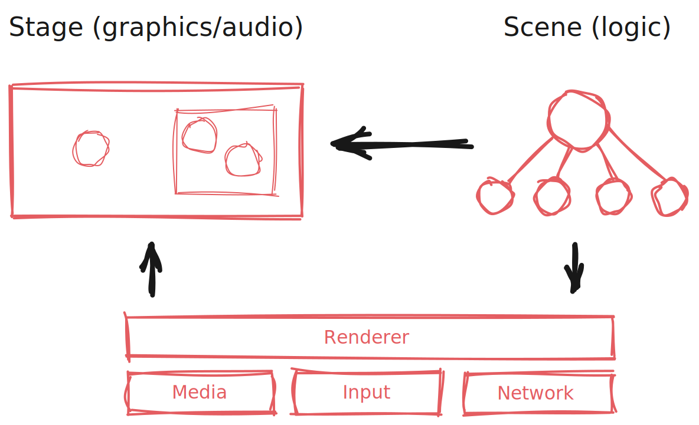

MultimediaLib
=============

Framework for building multimedia applications that support desktop, mobile, and web. 
MultimediaLib is mainly targeted at 2D graphics and animation, though 3D graphics are also 
supported.

MultimediaLib supports several different platforms:

- **Desktop:** Windows, Mac OS, Linix
- **Mobile:** iOS, Android
- **Web:** all modern browsers

MultimediaLib acts as an abstraction layer between the application layer and the underlying 
platform. This is a similar approach to other frameworks, but MultimediaLib differs in that it 
targets not only different mobile platforms, but also allows the same application to be used on 
desktop platforms and from the browser.
    
Usage
-----

The library is available from the Maven Central repository. To use it in a Maven project, add it 
to the dependencies section in `pom.xml`:

    <dependency>
        <groupId>nl.colorize</groupId>
        <artifactId>multimedialib</artifactId>
        <version>2020.4</version>
    </dependency>  
    
The library can also be used in Gradle projects:

    dependencies {
        compile "nl.colorize:multimedialib:2020.4"
    }
    
Concepts
--------

The *renderer* is the central access point for all platform-specific functionality, as depicted
in the picture above. Applications can access the renderer to display graphics, load media, check
for user input, or internet access.

MultimediaLib contains a number of renderer implementations, for different platforms and for
different types of applications. Some renderers are implemented using the platforms' native 
graphics API, other renderers are implemented on top of other libraries or frameworks. 
The following table shows an overview of the available renderer implementations:

| Renderer                                            | Desktop | Mobile | Web | 2D | 3D | Hardware-accelerated |
|-----------------------------------------------------|---------|--------|-----|----|----|----------------------|
| Java2D renderer                                     | ✓       | ×      | ×   | ✓  | ×  | Partially (OpenGL)   |
| [libGDX](https://libgdx.badlogicgames.com) renderer | ✓       | ✓      | ×   | ✓  | ✓  | Yes (OpenGL)         |
| HTML5 canvas renderer                               | ✓       | ✓      | ✓   | ✓  | ×  | Partially            |
| WebGL 2D renderer                                   | ✓       | ✓      | ✓   | ✓  | ×  | Yes (WebGL)          |
| [three.js](https://threejs.org) renderer            | ✓       | ✓      | ✓   | ✓  | ✓  | Yes (WebGL)          |

For application structure, MultimediaLib uses the same terminology from the theather world that
is used by animation software. The application consists of a *stage* and a number of *scenes*.

The stage contains everything that should be displayed. The stage can contain 2D graphics,
3D graphics, or a combination of the two.

Scenes are used to structure the application logic. Only one scene can be active at the same
time, but the application can return to the same scene multiple times, for example when accessing
a menu. When a scene ends, the stage is cleared. When the new scene is started, it can fill the
stage with everything that should be displayed during the scene. The scene will then update every
frame for as long as it is active. More complex scenes can be split into sub-scenes, with each
sub-scene responsible for one functional area. 
    
Starting the demo applications
------------------------------

MultimediaLib includes simple demo applications that showcase some of its features, and can be 
used as an example when using the framework to create applications. The demo applications can also
be used for verification purposes when testing the framework on new platforms. Two demo
applications are included: one for 2D graphics and one for 3D graphics. 

To run the demo for desktop platforms, create a normal build of the library using
`gradle assemble`, which builds both the desktop and browser versions.

To start the desktop version of the demo application, run the class
`nl.colorize.multimedialib.tool.DemoLauncher`. This class supports the following command line 
parameters:

| Name             | Required | Description                                   |
|------------------|----------|-----------------------------------------------|
| -renderer        | yes      | Renderer to use for the demo (java2d, gdx).   |
| -graphics        | yes      | Either '2d' or '3d'.                          |
| -framerate       | no       | Demo framerate, default is 60 fps.            |
| -canvas          | no       | Uses a fixed canvas size to display graphics. |
| -orientationlock | no       | Restricts the demo to landscape orientation.  |
| -verification    | no       | Prints instructions for verification.         |

Note that when using 3D graphics on Mac OS the command line argument `-XstartOnFirstThread` must
be present.

The browser version of the demo applications can be created by running 
`gradle transpileDemoApplication2D` and `gradle transpileDemoApplication3D` respectively.
The build output is then saved to the directories `build/browserdemo2d` and `browserdemo3d`, and 
can be started by opening the corresponding `index.html` in a browser.

Transpiling applications to HTML/JavaScript
-------------------------------------------

Applications using MultimediaLib are written in Java. However, these applications can be transpiled
to a combination of HTML and JavaScript so that they can be distributed via the web. This is done
using [TeaVM](http://teavm.org) and therefore only supports a subset of the Java language. 
Transpilation is started using the `TeaVMTranspiler` that is included as part of the library.
This command line tool takes the following arguments:

| Name         | Required | Description                                                                |
|--------------|----------|----------------------------------------------------------------------------|
| -project     | yes      | Project name for the application.                                          |
| -renderer    | yes      | One of 'canvas', 'webgl', 'three'.                                         |
| -resources   | yes      | Directory containing the application's resource files.                     |
| -out         | yes      | Output directory for the generated files.                                  |
| -main        | yes      | Main class that acts as application entry point.                           |

Loading image contents in JavaScript is not allowed unless when running on a remote host. This is
not a problem for "true" web applications, but can be problematic if the JavaScript version of the
application is embedded in a mobile app. For this reason, all image are converted to data URLs
during transpilation, so that they can be used without these restrictions.

Distributing applications
-------------------------

MultimediaLib does not include a distribution mechanism for applications, but it integrates with
other tools for each supported platform.

- **Windows:** Use [Launch4j](http://launch4j.sourceforge.net) to create a .exe file.
- **Mac OS:** Create an [application bundle](https://plugins.gradle.org/plugin/nl.colorize.gradle.macapplicationbundle)
  and installer, and distribute those via the Mac App Store.
- **iOS:** Use [Cordova](https://cordova.apache.org) to wrap the transpiled version of the
  application in a native app, and distribute that via the App Store.
- **Android:** Use [Cordova](https://cordova.apache.org) to wrap the transpiled version of the
  application in a native app, and distribute that via the Play Store.
- **Android:**
- **Web:** Upload the transpiled version of the application can be uploaded to a web server
  and distribute the corresponding URL.

Transpiling the application to iOS and Android
----------------------------------------------

Web applications created using TeaVM (as described above), can be embedded in iOS and/or Android
apps. The apps are created using [Cordova](https://cordova.apache.org). This means that the
build environment requires Cordova, Xcode, and Android Studio in order to create these apps.
Once the environment has been set up, `CordovaWrapper` can be added to the build. This command
takes the following arguments:

| Name       | Required | Description                                                     |
|------------|----------|-----------------------------------------------------------------|
| -webapp    | yes      | Directory containing the TeaVM version of the application.      |
| -out       | yes      | Output directory for the generated apps.                        |
| -platforms | no       | Comma-separated list of platforms, default is ios/android/osx.  |
| -appid     | yes      | Application identifier, e.g. nl.colorize.test.                  |
| -appname   | yes      | Application display name.                                       |
| -version   | yes      | Application version in the format x.y.z.                        |
| -icon      | yes      | Application icon, should be a 1024x1024 PNG image.              |
| -buildjson | yes      | Location of the Cordova build.json file.                        |
| -dist      | no       | Build distribution type, either 'release' (default) or 'debug'. |

Packing images into a sprite sheet
----------------------------------

A "sprite sheet" is a large image that consists of a large image that contains multiple sprites,
with each sprite is identified by a name and a set of coordinates. A sprite sheet consists of the
image plus a metadata file describing those coordinates. On most platforms sprite sheets have 
better performance characteristics than loading the images individually. 

MultimediaLib includes a tool to create a sprite sheet from all images within a directory. This
tool is started using `SpriteSheetPacker` that is part of the library. The tool takes the 
following arguments.

| Name      | Required | Description                                   |
|-----------|----------|-----------------------------------------------|
| -input    | yes      | Directory containing source images.           |
| -outimage | yes      | Generated image file location.                |
| -outdata  | yes      | Generated metadata file location.             |
| -metadata | yes      | Metadata file format, either 'yaml' or 'csv'. |
| -size     | yes      | Width/height of the sprite sheet.             |
| -exclude  | no       | Excludes all images beyond a certain size.    |

This will generate the PNG file containing the sprite sheet graphics and the YAML file with
metadata in the specified locations. Sprite sheets can then be loaded back as media assets.

Creating an application icon
----------------------------

MultimediaLib includes a command line tool for creating ICNS icons that can be used for Mac and/or
iOS applications. The entry point for this tool is `nl.colorize.multimedialib.tool.AppleIconTool`.

System requirements
-------------------

The library is cross-platform and supports Windows, macOS, and Linux, but requires the following 
software to be available:

- [Java JDK](http://java.oracle.com) 11+
- [Gradle](http://gradle.org)

Note that creating application that *use* MultimediaLib will usually have additional dependencies,
depending on which platforms are targeted.

- [Cordova](https://cordova.apache.org) 
- [Xcode](https://developer.apple.com/xcode/) (for iOS apps)
- [Android SDK](https://developer.android.com/sdk/index.html) (for Android apps)

Build instructions
------------------

The following Gradle build tasks are available:

- `gradle clean` cleans the build directory
- `gradle assemble` creates the JAR file for distribution
- `gradle test` runs all unit tests
- `gradle coverage` runs all unit tests and reports on test coverage
- `gradle javadoc` generates the JavaDoc API documentation
  
License
-------

Copyright 2009-2020 Colorize

The source code is licensed under the Apache License. Refer to
[http://www.apache.org/licenses/LICENSE-2.0](http://www.apache.org/licenses/LICENSE-2.0) for
the full license text.
